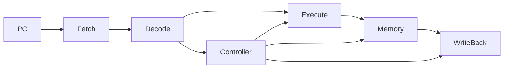

# MIPS-CPU
CPU for 5-stage pipeline, and trying to add MMU, Cache, branch predictor and etc

### 5-stage pipeline CPU for MIPS

Consider divide Decode as two stages: Decode and Registers Read, which maybe useful to Cache and Branch predictor.

